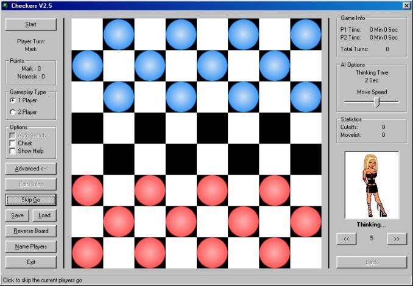



## AI Checkers 3

### Description

This is one of the ONLY AI programs on PSC. The AI checkers engine is very advanced and almost unbeatable!! This is the follow-on to the multi-award winning version 2. V3 is faster, more intelligent and boasts a whole host of new options and features. You think you good at checkers? think again!! I've included a rather good paper on the minimax algorithm (written by Ulli) and a copy of the international checkers rules in the zip file.
 
### More Info
 
You don't need to know much about AI to really understand this program. The coding is complicated in some places but nothing the intermediate programmer can't handle!!

             |
---                |---
**Submitted On**   |2000-12-12 22:08:32
**By**             |[Viper](https://github.com/Planet-Source-Code/PSCIndex/blob/master/ByAuthor/viper.md)
**Level**          |Intermediate
**User Rating**    |3.8 (34 globes from 9 users)
**Compatibility**  |VB 5\.0, VB 6\.0
**Category**       |[Games](https://github.com/Planet-Source-Code/PSCIndex/blob/master/ByCategory/games__1-38.md)
**World**          |[Visual Basic](https://github.com/Planet-Source-Code/PSCIndex/blob/master/ByWorld/visual-basic.md)
**Archive File**   |[CODE\_UPLOAD1262812122000\.zip](https://github.com/Planet-Source-Code/viper-ai-checkers-3__1-13550/archive/master.zip)

